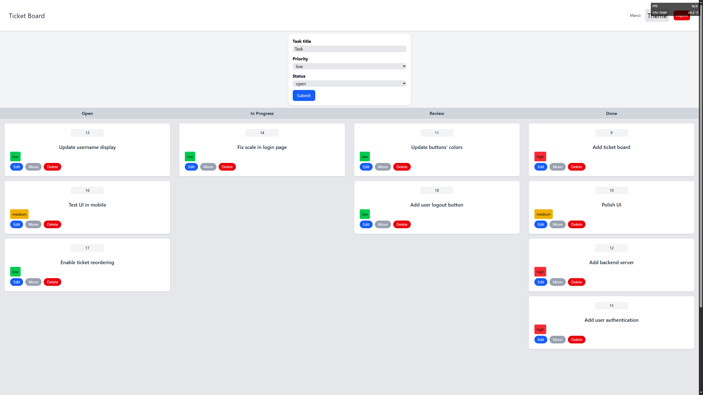
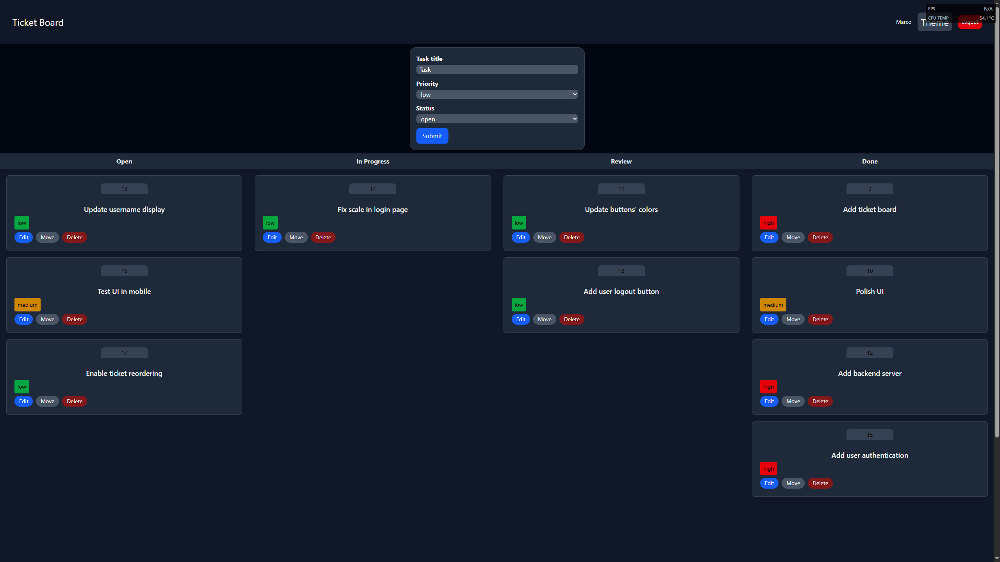

# TaskFlow


TaskFlow is a Kanban board for task management via tickets. TaskFlow enables fast and simple task management with drag-and-drop and edit in-place of tickets.

[Live Demo](https://taskflow-frontend-t4ww.onrender.com/) - first request may take ~1 min (free-tier auto-stop)

## Stack

**Frontend:** React 19, TypeScript, Tailwind CSS, React Router, @dnd-kit

**Backend:** ASP.NET Core (.NET 9), Entity Framework Core, Postgres

**Auth:** JWT + BCrypt

**Infrastructure:** Docker, nginx, GitHub Actions CI, Render (deploy)

## Screenshots

### Light mode



### Dark mode



## Quick start

### With Docker

```bash
docker compose up --build
```

The app runs at http://localhost (frontend) with the API at http://localhost:8080

### Without Docker

Backend:

```bash
cd TaskFlow.Api
dotnet restore
dotnet ef database update
dotnet run -- --auto-create-jwt true
```

Frontend:

```bash
cd taskflow-frontend
npm install
npm run dev
```

The app runs at http://localhost:5173 with the API at http://localhost:5278

## Decisions

- Postgres over SQLite: same database in development and production (dev/prod parity). SQLite doesn't survive container restarts without volume hacks;
- JWT over cookies: simpler implementation for a SPA, token stored in localStorage;
- nginx as reverse proxy: serves static frontend files and proxies /api to the backend, avoiding CORS in Docker;
- Multi-stage Docker builds: final images contain only runtime dependencies.

## What I'd do differently at scale

- Refresh token rotation (current JWT has no expiration strategy)
- Rate limiting on auth endpoints
- Redis cache layer for frequently read tickets
- Connection pooling with PgBouncer
- E2E tests with Playwright
